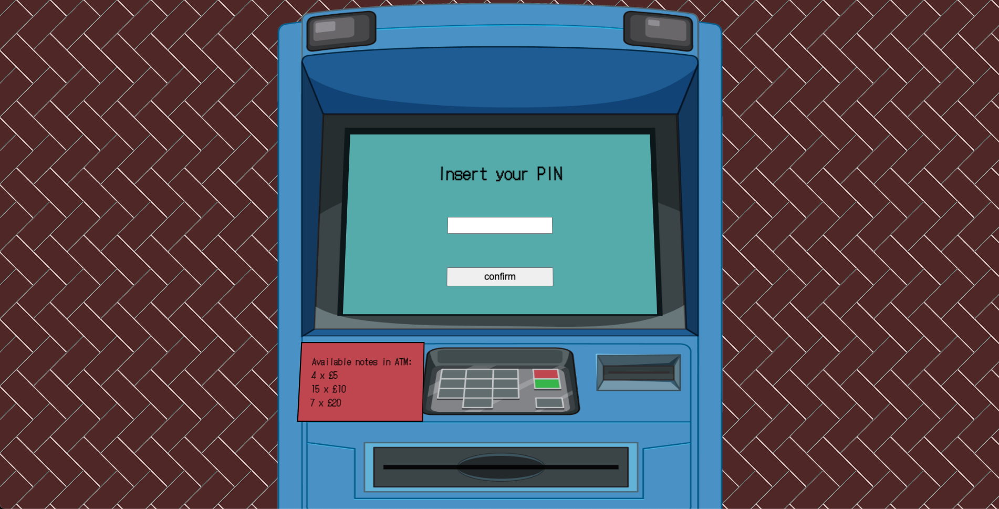

# Recruitment task for company X

## Task content

### The ATM App

It’s payday and there’s a new Pokémon game in town so Michael wants to buy a Switch It costs £270, and we’d like you to build an ATM web app he can use.

He will need to enter his PIN (1111) which you should check against our PIN API. The API will tell you his current balance, which should then be shown on screen.

He’s going to make 3 withdrawals: £140, £50, £90.

Unbeknownst to Michael, diggers keep stealing our ATMs so we aren’t carrying a lot of notes. The machine has: 4x£5notes, 15 x £10 notes, 7 x £20 notes.

You should try to give a roughly even mix of notes when possible, and will have to take into account what to do when certain ones run out.
Your ATM allows an overdraft of up to £100 and should let users know if they do go overdrawn.

### The PIN API

This is a simple endpoint to let you check a user’s PIN. You make a POST call to: https:/example.com/api/pin/. If all is good, the API will return with a 200 status with currentBalance. If you’ve coded your request wrong, you will get an error message to help you out, or a 403 error which says if the PIN itself is wrong.

### Guidance

The challenge is a chance for you to show off, so pick the tools/frameworks/libraries etc that you know best. We’ve deliberately asked you to work on this at home so you aren’t under any fake pressures and can use the laptop/editor etc that you like best.
- Please put your finished work on Github, or if you need it to be private, please zip your folder, upload it to https://wetransfer.com/ and email us the link
- Include a readme with setup instructions and anything else you’d like us to know.
- We know tests aren’t everyone’s favourite thing, but we write them a lot.
- Brownie points go towards apps with great UX and code we’d be happy to maintain in a real app.

## How to run the app

In the project directory, you can run:

### `npm start`

I have also deployed the app to vercel, you can check it here:

### [https://recruitment-task-atm.vercel.app/](https://recruitment-task-atm.vercel.app/)

## Some explanations about code architecture, libraries etc. Why I decided to do some things like I did:

1. App is created in `CRA`, app don't needs any side rendering or routing, so it is perfect choice
2. For styling I've chosen styled modules, I've wanted to make something interesting so I added ATM picture and fitted whole application in ATM screen, it looks cool, but also needs a lot of magic numbers. So styled modules are kinda good for that kind of things.
3. I've decided to not use forms here, it is actually not exactly web app, the whole idea was to build more like for real ATM ;) So that means project don't need to be correct that much from semantic perspective.
4. App is not responsive ;)
5. Withdraw algorithm, you can read more about in `src/Atm/helpers/calculateWithdraw.ts`
6. From front-end side this app is pretty dumb so I have decided to not adding test for UI. But it is definitely good to test withdraw functionality so I've created test to check if everything works correct: `calculateWithdraw.test.ts`